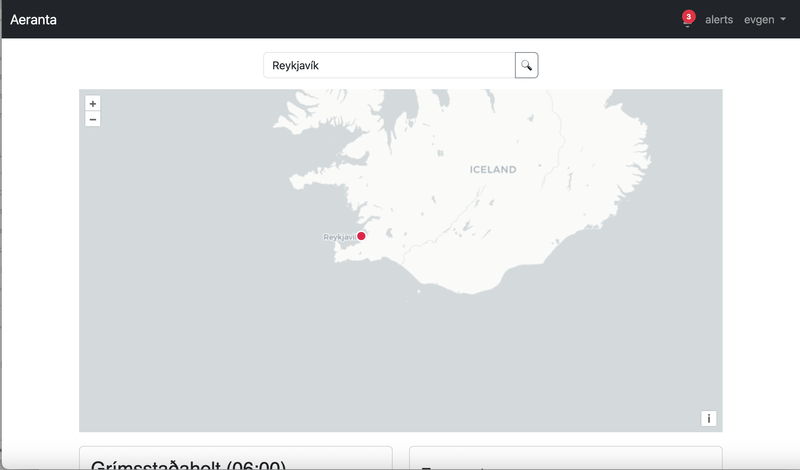
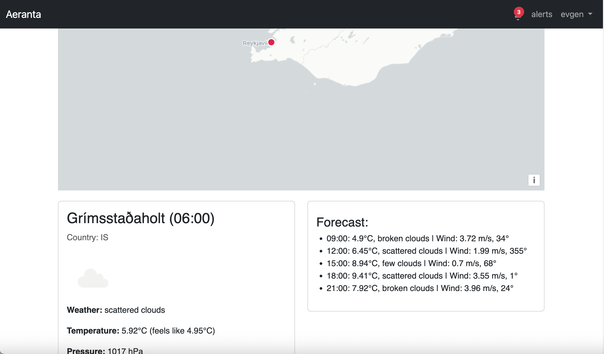
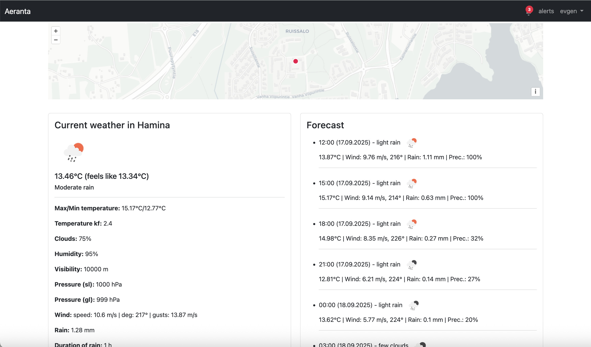
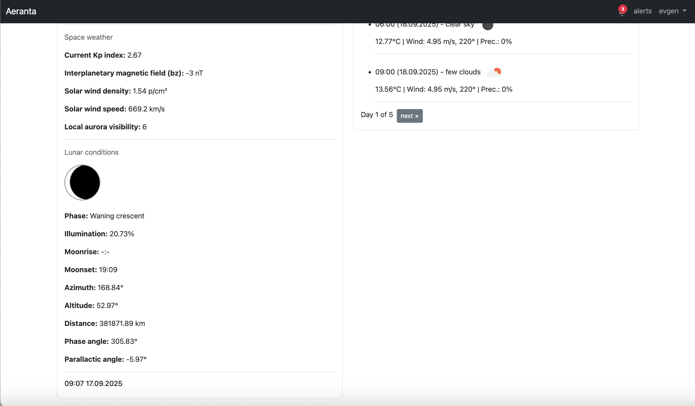
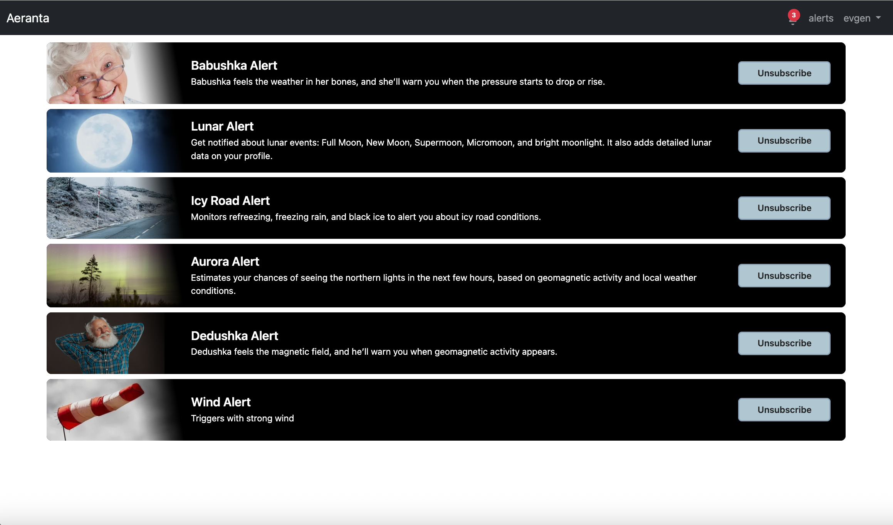
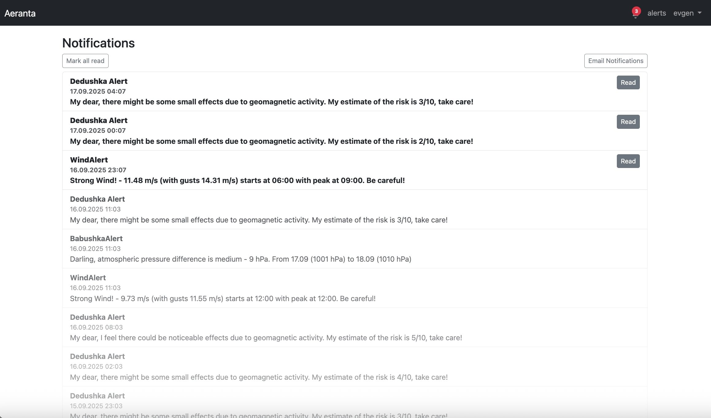
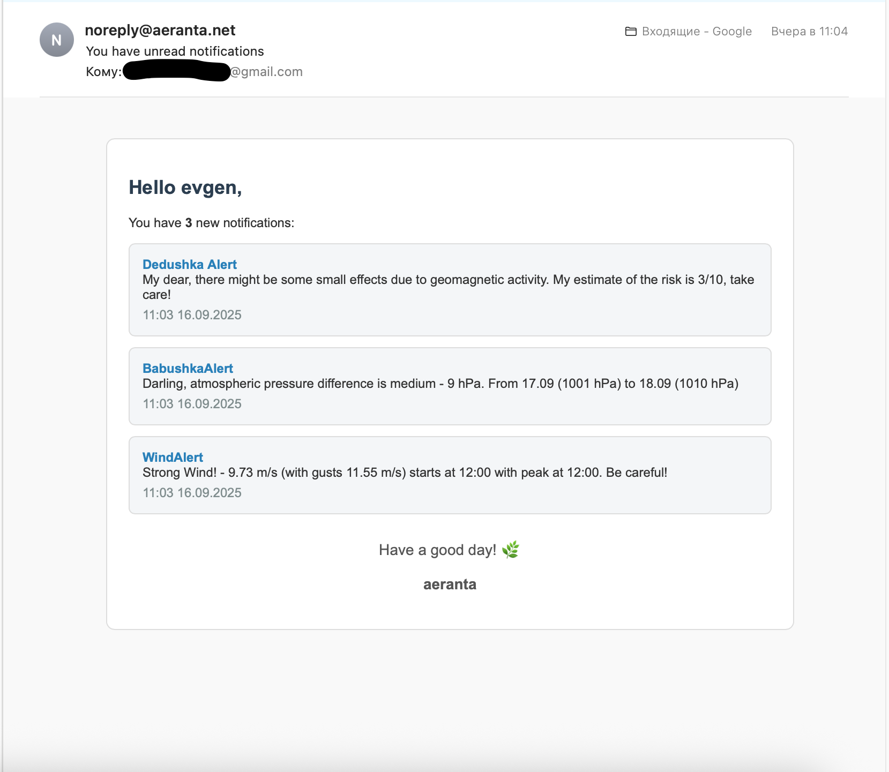

# Aeranta

**Aeranta** is a scalable personal web weather station that provides up-to-date information about current weather conditions and forecasts.

---

## ✨ Features
- **Alert system** – subscribe to notifications about geomagnetic storms, atmospheric pressure changes, auroras, lunar alerts, wind, and ice risks. Alerts are delivered both in-app and via email.  
- **Customizable alert subscriptions** – extend user profile with extra data blocks (e.g. Space Weather, Lunar Conditions).  
- **Minimalist interface** – intuitive UI, designed for accessibility and simplicity.  
- **Interactive map**:
  - without registration: quick weather overview for any point;  
  - with registration: set exact coordinates in the profile.  
- **Extensibility** – easy integration of new APIs and alert types.  

---

## 🛠 Tech stack
- **Backend**: Python, Django  
- **Task queue**: Celery + Redis  
- **Frontend**: OpenLayers, custom JavaScript, HTML/CSS  
- **Database**: PostgreSQL + PostGIS  
- **APIs**: OpenWeather API, Auroras.live API, IPG Astronomy API  
- **Infrastructure**: Docker, Docker Compose, Nginx  
- **Notifications**: Email via SMTP  

---

## 🌍 Live Demo
Explore Aeranta online:

👉 **[https://aeranta.net](https://aeranta.net)**  

---

## 📸 Screenshots

